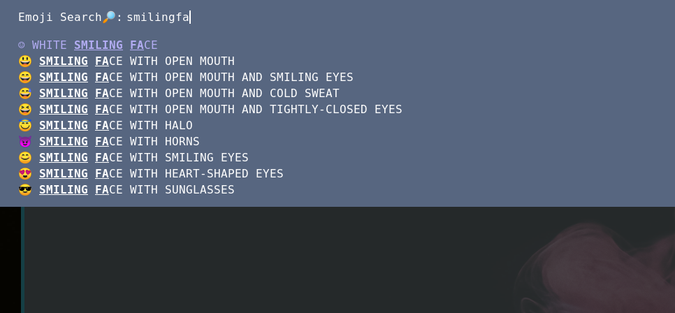

# Rofi Emoji Search



A Rofi script which lets you search for emojis and copy them to your clipboard.

Paths in the script and Rofi config are written assuming these files are in
`~/.config/rofi-emoji-search/`.

## Example Usage

```
rofi -show 'Emoji Search🔎' -config ~/.config/rofi-emoji-search/config.rasi
```

## Shortcuts

Rofi has been tweaked with a few Vim-like shortcuts:

| Shortcut  | Function   |
| ---------------------- |-
| Control-j | Move down  |
| Control-k | Move up    |
| Control-d | Page down  |
| Control-u | Page up    |

## Requirements
* Rofi 1.4.0+
* xclip
* notify-send
* An emoji-compatible font
